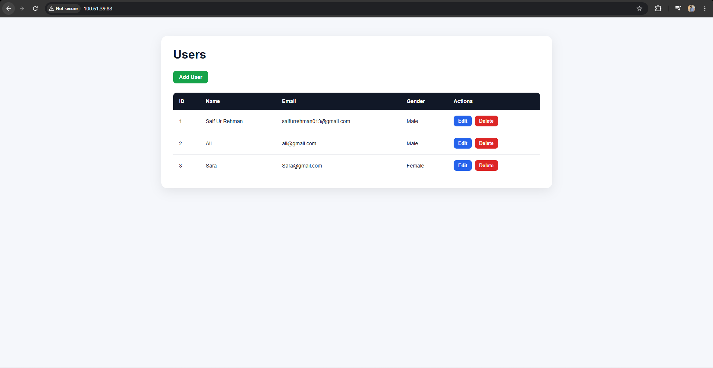
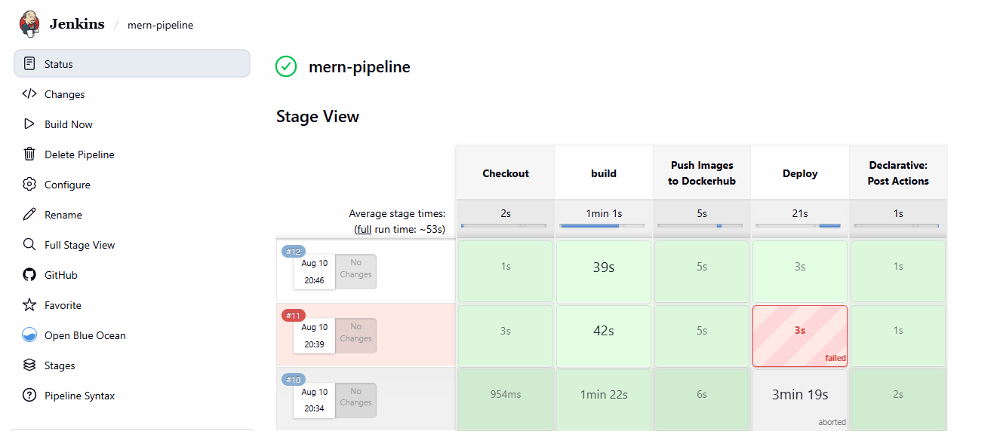
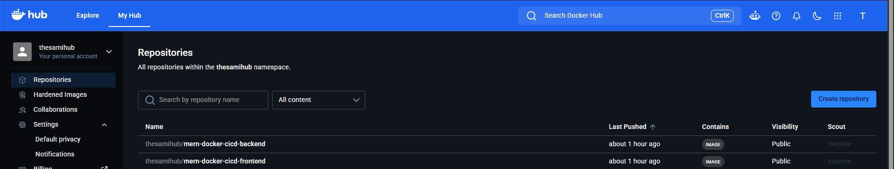

# MERN Stack CRUD — Docker & CI/CD Practice

A full-stack **MERN CRUD application** built to practice containerization, reverse proxy configuration, and CI/CD deployment.

The project uses **React, Node.js, Express, MongoDB Atlas, Docker, Nginx, Jenkins, Docker Hub, and AWS EC2**.

## Tech Stack

* **Frontend:** React, Axios, React Router
* **Backend:** Node.js, Express.js, Mongoose
* **Database:** MongoDB Atlas
* **Containers:** Docker, Docker Compose
* **Reverse Proxy:** Nginx
* **CI/CD:** Jenkins, GitHub, Docker Hub
* **Deployment:** AWS EC2

## Features

* Create, view, edit, and delete users
* REST API with Express.js
* MongoDB Atlas integration
* Dockerized frontend and backend
* Nginx reverse proxy
* Jenkins CI/CD pipeline
* Docker images pushed to Docker Hub
* Automated deployment to AWS EC2

## Project Structure

```text
MERN_Stack_CRUD/
├── backend/
├── frontend/
├── nginx/
├── docker-compose.yml
├── docker-compose-prod.yml
├── Jenkinsfile
└── README.md
```

## Run Locally

### 1. Clone the repository

```bash
git clone https://github.com/thesamihub/mern-docker-cicd.git
cd mern-docker-cicd
```

### 2. Configure MongoDB

Create:

```text
backend/.env
```

Add your MongoDB connection string:

```env
MONGO_URI=your_mongodb_connection_string
```

### 3. Start the application

```bash
docker compose up --build
```

Then open:

```text
http://localhost
```

To run in the background:

```bash
docker compose up -d --build
```

To stop:

```bash
docker compose down
```

To view logs:

```bash
docker compose logs -f
```

## Architecture

```text
              Browser
                 │
                 ▼
            Nginx :80
             /       \
            ▼         ▼
       React App    Node/Express
                       │
                       ▼
                  MongoDB Atlas
```

Nginx handles incoming requests and routes `/api/*` requests to the Node.js backend.

## CI/CD Workflow

```text
GitHub
   ↓
Jenkins
   ↓
Build Docker Images
   ↓
Push to Docker Hub
   ↓
SSH into AWS EC2
   ↓
Docker Compose Pull
   ↓
Deploy Containers
```

## Screenshots





---

## REST API

| Method | Endpoint         | Description   |
| ------ | ---------------- | ------------- |
| GET    | `/api/users`     | Get all users |
| POST   | `/api/users`     | Create user   |
| GET    | `/api/users/:id` | Get user      |
| PATCH  | `/api/users/:id` | Update user   |
| DELETE | `/api/users/:id` | Delete user   |

## DevOps Practice

This project was mainly used to gain hands-on experience with:

* Dockerfiles and Docker Compose
* Container networking
* Nginx reverse proxy
* Docker Hub image management
* Jenkins pipelines and credentials
* SSH-based deployment
* AWS EC2
* Environment variables
* Troubleshooting deployment and networking issues

## Author

**Sami Ur Rehman**

Computer Science Undergraduate | Aspiring DevOps Engineer

* GitHub: https://github.com/thesamihub
* LinkedIn: https://linkedin.com/in/sami-ur-rehman-devops
